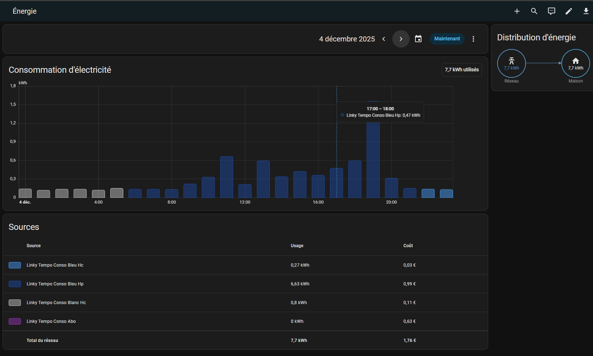
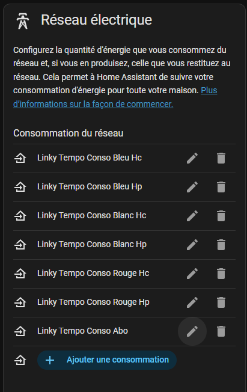
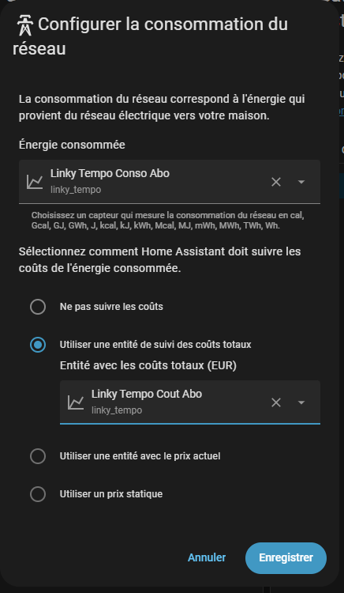

#Notice

**The documentation below is provided in French because this tool is exclusively intended for French Tempo users.**

---

# ⚡ ha-tempo — Tutoriel complet pour afficher la consommation & les coûts Tempo dans Home Assistant



---

## 📘 Présentation

**ha-tempo** est un tutoriel permettant d'afficher dans le tableau de bord **Énergie** de **Home Assistant** :

* Les **consommations Tempo** (Bleu / Blanc / Rouge, HC & HP)
* Les **coûts associés**
* L'**abonnement**

Ce guide vous accompagne pas à pas pour mettre en place les capteurs nécessaires, installer le script de mise à jour Linky Tempo, configurer les thèmes et automatiser l'import des données.

---

# 🧩 Prérequis

### 🔌 1. Intégration Linky

➡️ [https://github.com/bokub/ha-linky](https://github.com/bokub/ha-linky)

### 🔵 2. Extension RTE Tempo

➡️ [https://github.com/hekmon/rtetempo](https://github.com/hekmon/rtetempo)

### 🎨 3. Thème Tempo

➡️ [https://github.com/hekmon/hatempotheme](https://github.com/hekmon/hatempotheme)

### 🖥️ 4. Un moyen d’exécuter des scripts Python

Exemples :

* **Studio Code Server**
* terminal SSH
* addon Terminal & SSH

---

# 🆔 Récupération du PRM & création du token Home Assistant

### 📥 1. Récupérer votre numéro PRM

Home Assistant → **Paramètres** → **Module complémentaire** → **Linky** → **Configuration** → ✏️ **Modifier** → copier le **PRM**, puis *Annuler*.

### 🔑 2. Créer un jeton longue durée

Home Assistant → **Nom d'utilisateur** → **Sécurité** → **Jetons d’accès longue durée** → **Créer un jeton**.

Copiez et conservez précieusement ce jeton.

---

# 📝 Installation du script de mise à jour

### 📄 1. Copier le script

Dans **Studio Code Server**, placez `linky_tempo_updater.py` dans le dossier :

```
/config
```

### ✏️ 2. Modifier le script

Ouvrez le fichier `linky_tempo_updater.py` et renseignez :

* **ligne 17** : `TOKEN = "TON_TOKEN"` remplacez `TON_TOKEN` par votre TOKEN récupéré précédemment
* **ligne 19** : `SOURCE_STAT_ID = "linky:TON_PRM" ` remplacez `TON_PRM` par votre PRM récupéré précédemment

---

# ⚙️ Modifications du fichier `configuration.yaml`

Ajoutez les blocs suivants :

---

## 🎨 Thème Tempo pour le tableau Énergie

```yaml
frontend:
  themes:
    TempoTheme:
      # Couleurs du graphique Énergie (l'ordre est crucial)
      energy-grid-consumption-color-0: "#2196F3" # 1. Bleu HC (Bleu clair)
      energy-grid-consumption-color-1: "#0D47A1" # 2. Bleu HP (Bleu foncé)
      energy-grid-consumption-color-2: "#E0E0E0" # 3. Blanc HC (Gris clair/Blanc)
      energy-grid-consumption-color-3: "#616161" # 4. Blanc HP (Gris foncé)
      energy-grid-consumption-color-4: "#EF5350" # 5. Rouge HC (Rouge clair)
      energy-grid-consumption-color-5: "#B71C1C" # 6. Rouge HP (Rouge foncé)
      energy-grid-consumption-color-6: "#9C27B0" # 7. Abonnement (Violet)
      modes:
        dark:
          energy-grid-consumption-color-2: "#BDBDBD" # Blanc plus visible en mode sombre
```

---

## 🖥️ Commande Shell

```yaml
shell_command:
  update_linky_tempo: "python3 /config/linky_tempo_updater.py"
```

---

## 🔢 Input Numbers (consommations & coûts)

```yaml
input_number:
  linky_conso_bleu_hc:
    name: Conso Bleu HC
    min: 0
    max: 100000
    step: 0.01
    unit_of_measurement: kWh
    icon: mdi:flash
  linky_conso_bleu_hp:
    name: Conso Bleu HP
    min: 0
    max: 100000
    step: 0.01
    unit_of_measurement: kWh
    icon: mdi:flash

  linky_conso_blanc_hc:
    name: Conso Blanc HC
    min: 0
    max: 100000
    step: 0.01
    unit_of_measurement: kWh
    icon: mdi:flash
  linky_conso_blanc_hp:
    name: Conso Blanc HP
    min: 0
    max: 100000
    step: 0.01
    unit_of_measurement: kWh
    icon: mdi:flash

  linky_conso_rouge_hc:
    name: Conso Rouge HC
    min: 0
    max: 100000
    step: 0.01
    unit_of_measurement: kWh
    icon: mdi:flash
  linky_conso_rouge_hp:
    name: Conso Rouge HP
    min: 0
    max: 100000
    step: 0.01
    unit_of_measurement: kWh
    icon: mdi:flash

  linky_cout_bleu_hc:
    name: Coût Bleu HC
    min: 0
    max: 100000
    step: 0.01
    unit_of_measurement: EUR
    icon: mdi:currency-eur
  linky_cout_bleu_hp:
    name: Coût Bleu HP
    min: 0
    max: 100000
    step: 0.01
    unit_of_measurement: EUR
    icon: mdi:currency-eur

  linky_cout_blanc_hc:
    name: Coût Blanc HC
    min: 0
    max: 100000
    step: 0.01
    unit_of_measurement: EUR
    icon: mdi:currency-eur
  linky_cout_blanc_hp:
    name: Coût Blanc HP
    min: 0
    max: 100000
    step: 0.01
    unit_of_measurement: EUR
    icon: mdi:currency-eur

  linky_cout_rouge_hc:
    name: Coût Rouge HC
    min: 0
    max: 100000
    step: 0.01
    unit_of_measurement: EUR
    icon: mdi:currency-eur
  linky_cout_rouge_hp:
    name: Coût Rouge HP
    min: 0
    max: 100000
    step: 0.01
    unit_of_measurement: EUR
    icon: mdi:currency-eur

  linky_cout_abo:
    name: Coût Abonnement
    min: 0
    max: 1000
    step: 0.01
    unit_of_measurement: EUR
    icon: mdi:calendar-clock
```

Après modification → **Redémarrez Home Assistant**.

---

# 🐍 Installation des dépendances Python

Dans un terminal :

```bash
mkdir -p deps
pip install websocket-client --target=/config/deps
pip install requests --target=/config/deps
pip install python-dateutil --target=/config/deps
```

---

# ▶️ Lancer le script

```bash
python3 linky_tempo_updater.py
```

### ✔️ Exemple de sortie

```
🚀 DÉMARRAGE LINKY TEMPO UPDATER
✨ Premier lancement : Initialisation au 01/08/2025.
   -> 720 points bruts.
   -> 720 points bruts.
   -> 719 points bruts.
   -> 720 points bruts.
   -> 215 points bruts.
📅 Récupération Calendrier Tempo...
   ✅ 133 jours chargés.
⚙️ Calcul des tarifs pour 3093 points (Conv Wh->kWh)...
💾 Injection Base de données...
📝 Mise à jour Input Numbers...
💾 État sauvegardé. Prochain scan : 2025-12-07T22:00:00+00:00
✅ TERMINÉ SUCCÈS. Données jusqu'au 2025-12-07 22:00:00+00:00
```


---

# 📊 Configuration du Dashboard Énergie

L'ordre d'ajout des statistiques est **crucial** pour respecter les couleurs du thème Tempo.

Ajoutez les entités **dans cet ordre précis** :

1. **Linky Tempo Conso Bleu HC**
2. **Linky Tempo Conso Bleu HP**
3. **Linky Tempo Conso Blanc HC**
4. **Linky Tempo Conso Blanc HP**
5. **Linky Tempo Conso Rouge HC**
6. **Linky Tempo Conso Rouge HP**
7. **Linky Tempo Conso Abo**



---

## ⚙️ Paramétrage de chaque statistique

Pour **chaque** statistique d’énergie Tempo :

1. Sélectionnez l’entité de **consommation** (kWh)
2. Cochez : **Utiliser une entité de suivi des coûts totaux**
3. Sélectionnez l’entité correspondante de **coût** (EUR)



---

# 🤖 Automatisation

Pour automatiser la mise à jour quotidienne des données Tempo :

1. Aller dans **Paramètres → Automatisations et scènes**
2. Cliquez sur **Créer une automatisation**
3. Puis sur **Créer une nouvelle automatisation**
4. Passer en mode **YAML** et remplacer tout le contenu par :

```yaml
alias: Mise à jour Linky Tempo quotidienne
description: Lance le script python pour traiter les données Linky de la veille à 07h00
triggers:
  - at: "07:00:00"
    trigger: time
conditions: []
actions:
  - data: {}
    action: shell_command.update_linky_tempo
mode: single
```

---

# ❗ En cas de problème

### 🔄 Réinitialiser les données Tempo

1. Supprimer le fichier :

```
/config/linky_tempo_state.json
```

2. Home Assistant → **Paramètres** → **Outils de développement** → **Statistiques** → rechercher `linky_tempo` → "Passer en mode sélection" → sélectionner tout → **Supprimer**.

3. Relancer :

```bash
python3 linky_tempo_updater.py
```


Testé sur : **Home Assistant OS core-2025.12.1 sur Raspberry Pi**.
